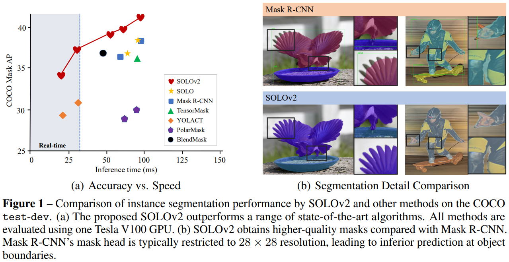

modified by SONG:
> 0、将onnx模型导出文件整合进了soloV2训练仓库中;
> 1、训练命令和验证命令都写成了train.sh和test.sh的形式;
> 2、需要的mmcv版本可以查看需要额外安装的包.txt;
> 3、mmcv-0.4.3源码安装包在requirements文件夹下;
> 4、训练模型和生成onnx步骤onenote;
# SOLO: Segmenting Objects by Locations

This project hosts the code for implementing the SOLO algorithms for instance segmentation.

> [**SOLO: Segmenting Objects by Locations**](https://arxiv.org/abs/1912.04488),            
> Xinlong Wang, Tao Kong, Chunhua Shen, Yuning Jiang, Lei Li    
> In: Proc. European Conference on Computer Vision (ECCV), 2020  
> *arXiv preprint ([arXiv 1912.04488](https://arxiv.org/abs/1912.04488))*   


> [**SOLOv2: Dynamic and Fast Instance Segmentation**](https://arxiv.org/abs/2003.10152),            
> Xinlong Wang, Rufeng Zhang, Tao Kong, Lei Li, Chunhua Shen     
> In: Proc. Advances in Neural Information Processing Systems (NeurIPS), 2020  
> *arXiv preprint ([arXiv 2003.10152](https://arxiv.org/abs/2003.10152))*  




## Highlights
- **Totally box-free:**  SOLO is totally box-free thus not being restricted by (anchor) box locations and scales, and naturally benefits from the inherent advantages of FCNs.
- **Direct instance segmentation:** Our method takes an image as input, directly outputs instance masks and corresponding class probabilities, in a fully convolutional, box-free and grouping-free paradigm.
- **High-quality mask prediction:** SOLOv2 is able to predict fine and detailed masks, especially at object boundaries.
- **State-of-the-art performance:** Our best single model based on ResNet-101 and deformable convolutions achieves **41.7%** in AP on COCO test-dev (without multi-scale testing). A light-weight version of SOLOv2 executes at **31.3** FPS on a single V100 GPU and yields **37.1%** AP.

## Updates
   - SOLOv2 implemented on detectron2 is released at [adet](https://github.com/aim-uofa/AdelaiDet/blob/master/configs/SOLOv2/README.md). (07/12/20)
   - Training speeds up (~1.7x faster) for all models. (03/12/20)
   - SOLOv2 is available. Code and trained models of SOLOv2 are released. (08/07/2020)
   - Light-weight models and R101-based models are available. (31/03/2020) 
   - SOLOv1 is available. Code and trained models of SOLO and Decoupled SOLO are released. (28/03/2020)


## Installation
This implementation is based on [mmdetection](https://github.com/open-mmlab/mmdetection)(v1.0.0). Please refer to [INSTALL.md](docs/INSTALL.md) for installation and dataset preparation.

## Models
For your convenience, we provide the following trained models on COCO (more models are coming soon).
If you need the models in [PaddlePaddle](https://github.com/PaddlePaddle/Paddle) framework, please refer to [paddlepaddle/README.md](./paddlepaddle/README.MD).


Model | Multi-scale training | Testing time / im | AP (minival) | Link
--- |:---:|:---:|:---:|:---:
SOLO_R50_1x | No | 77ms | 32.9 | [download](https://cloudstor.aarnet.edu.au/plus/s/nTOgDldI4dvDrPs/download)
SOLO_R50_3x | Yes | 77ms |  35.8 | [download](https://cloudstor.aarnet.edu.au/plus/s/x4Fb4XQ0OmkBvaQ/download)
SOLO_R101_3x | Yes | 86ms |  37.1 | [download](https://cloudstor.aarnet.edu.au/plus/s/WxOFQzHhhKQGxDG/download)
Decoupled_SOLO_R50_1x | No | 85ms | 33.9 | [download](https://cloudstor.aarnet.edu.au/plus/s/RcQyLrZQeeS6JIy/download)
Decoupled_SOLO_R50_3x | Yes | 85ms | 36.4 | [download](https://cloudstor.aarnet.edu.au/plus/s/dXz11J672ax0Z1Q/download)
Decoupled_SOLO_R101_3x | Yes | 92ms | 37.9 | [download](https://cloudstor.aarnet.edu.au/plus/s/BRhKBimVmdFDI9o/download)
SOLOv2_R50_1x | No | 54ms | 34.8 | [download](https://cloudstor.aarnet.edu.au/plus/s/DvjgeaPCarKZoVL/download)
SOLOv2_R50_3x | Yes | 54ms | 37.5 | [download](https://cloudstor.aarnet.edu.au/plus/s/nkxN1FipqkbfoKX/download)
SOLOv2_R101_3x | Yes | 66ms | 39.1 | [download](https://cloudstor.aarnet.edu.au/plus/s/61WDqq67tbw1sdw/download)
SOLOv2_R101_DCN_3x | Yes | 97ms | 41.4 | [download](https://cloudstor.aarnet.edu.au/plus/s/4ePTr9mQeOpw0RZ/download)
SOLOv2_X101_DCN_3x | Yes | 169ms | 42.4 | [download](https://cloudstor.aarnet.edu.au/plus/s/KV9PevGeV8r4Tzj/download)

**Light-weight models:**

Model | Multi-scale training | Testing time / im | AP (minival) | Link
--- |:---:|:---:|:---:|:---:
Decoupled_SOLO_Light_R50_3x | Yes | 29ms | 33.0 | [download](https://cloudstor.aarnet.edu.au/plus/s/d0zuZgCnAjeYvod/download)
Decoupled_SOLO_Light_DCN_R50_3x | Yes | 36ms | 35.0 | [download](https://cloudstor.aarnet.edu.au/plus/s/QvWhOTmCA5pFj6E/download)
SOLOv2_Light_448_R18_3x | Yes | 19ms | 29.6 | [download](https://cloudstor.aarnet.edu.au/plus/s/HwHys05haPvNyAY/download)
SOLOv2_Light_448_R34_3x | Yes | 20ms | 32.0 | [download](https://cloudstor.aarnet.edu.au/plus/s/QLQpXg9ny7sNA6X/download)
SOLOv2_Light_448_R50_3x | Yes | 24ms | 33.7 | [download](https://cloudstor.aarnet.edu.au/plus/s/cn1jABtVJwsbb2G/download)
SOLOv2_Light_512_DCN_R50_3x | Yes | 34ms | 36.4 | [download](https://cloudstor.aarnet.edu.au/plus/s/pndBdr1kGOU2iHO/download)

*Disclaimer:*

- Light-weight means light-weight backbone, head and smaller input size. Please refer to the corresponding config files for details.
- This is a reimplementation and the numbers are slightly different from our original paper (within 0.3% in mask AP).


## Usage

### A quick demo

Once the installation is done, you can download the provided models and use [inference_demo.py](demo/inference_demo.py) to run a quick demo.

### Train with multiple GPUs
    ./tools/dist_train.sh ${CONFIG_FILE} ${GPU_NUM}

    Example: 
    ./tools/dist_train.sh configs/solo/solo_r50_fpn_8gpu_1x.py  8

### Train with single GPU
    python tools/train.py ${CONFIG_FILE}
    
    Example:
    python tools/train.py configs/solo/solo_r50_fpn_8gpu_1x.py

### Testing
    # multi-gpu testing
    ./tools/dist_test.sh ${CONFIG_FILE} ${CHECKPOINT_FILE} ${GPU_NUM}  --show --out  ${OUTPUT_FILE} --eval segm
    
    Example: 
    ./tools/dist_test.sh configs/solo/solo_r50_fpn_8gpu_1x.py SOLO_R50_1x.pth  8  --show --out results_solo.pkl --eval segm

    # single-gpu testing
    python tools/test_ins.py ${CONFIG_FILE} ${CHECKPOINT_FILE} --show --out  ${OUTPUT_FILE} --eval segm
    
    Example: 
    python tools/test_ins.py configs/solo/solo_r50_fpn_8gpu_1x.py  SOLO_R50_1x.pth --show --out  results_solo.pkl --eval segm


### Visualization

    python tools/test_ins_vis.py ${CONFIG_FILE} ${CHECKPOINT_FILE} --show --save_dir  ${SAVE_DIR}
    
    Example: 
    python tools/test_ins_vis.py configs/solo/solo_r50_fpn_8gpu_1x.py  SOLO_R50_1x.pth --show --save_dir  work_dirs/vis_solo

## Contributing to the project
Any pull requests or issues are welcome.

## Citations
Please consider citing our papers in your publications if the project helps your research. BibTeX reference is as follows.
```
@inproceedings{wang2020solo,
  title     =  {{SOLO}: Segmenting Objects by Locations},
  author    =  {Wang, Xinlong and Kong, Tao and Shen, Chunhua and Jiang, Yuning and Li, Lei},
  booktitle =  {Proc. Eur. Conf. Computer Vision (ECCV)},
  year      =  {2020}
}

```

```
@article{wang2020solov2,
  title={SOLOv2: Dynamic and Fast Instance Segmentation},
  author={Wang, Xinlong and Zhang, Rufeng and  Kong, Tao and Li, Lei and Shen, Chunhua},
  journal={Proc. Advances in Neural Information Processing Systems (NeurIPS)},
  year={2020}
}
```

## License

For academic use, this project is licensed under the 2-clause BSD License - see the LICENSE file for details. For commercial use, please contact [Xinlong Wang](https://www.xloong.wang/) and  [Chunhua Shen](https://cs.adelaide.edu.au/~chhshen/).
